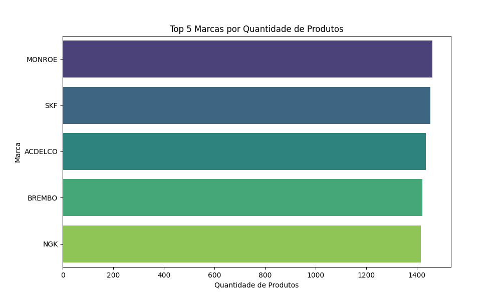
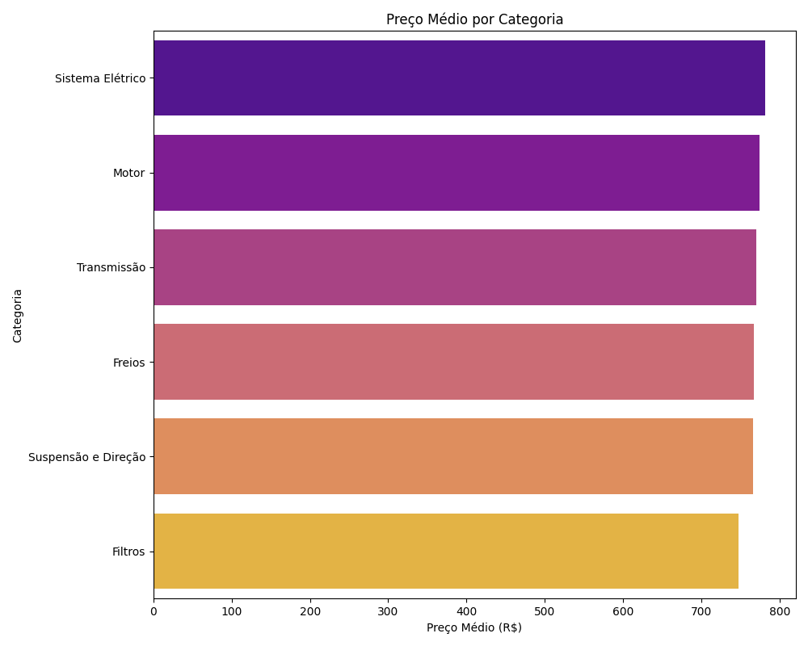

# 🚀 Pipeline ETL - Desafio Técnico Hubbi

  

[](https://www.python.org/downloads/)

  

Este projeto é a solução completa para o **Desafio Técnico de Estágio de Dados da Hubbi**. Implementa um pipeline ETL (Extract, Transform, Load) que coleta dados de produtos de um site teste (`https://testdata.devmka.online/`), realiza transformações e normalização dos dados, e os persiste em banco de dados SQLite e arquivo CSV.

## 📋 Pré-requisitos

  

Certifique-se de ter instalado:

-  **Python 3.14.0** ou superior

  

-  **pip** (gerenciador de pacotes Python)

  

-  **Git** (para clonar o repositório)

  

  

> ⚠️ **Nota:** Este projeto foi desenvolvido e testado com Python 3.14.0. Versões anteriores podem funcionar, mas não foram testadas.

  

  

## 🔧 Instalação

  

  

### 1. Clone o Repositório

  

  

```bash
git  clone  https://github.com/eribert0/hubbi-desafio-ETL.git
 
cd  hubbi-desafio-ETL  
```

  

  

### 2. Crie um Ambiente Virtual

  

  

**Windows (PowerShell):**

  

```powershell
python -m venv .venv

.\.venv\Scripts\Activate.ps1
```

  

  

**Linux/Mac:**

  

```bash
python3  -m  venv  .venv

source  .venv/bin/activate
```

  

  

### 3. Instale as Dependências

  

  

```bash
pip  install  -r  requirements.txt 
```

  

  

## ▶️ Como Executar

  

  

Com o ambiente virtual ativado, execute:

  

  

```bash
python  etl.py
```

  

## 🏗️ Arquitetura e Decisões de Design

  

  

Durante o desenvolvimento, algumas decisões-chave foram tomadas para garantir a eficiência do pipeline:

  

  

### 1. **Extração via API REST (em vez de Web Scraping)**

**Problema Identificado:** O site `testdata.devmka.online` carrega os produtos dinamicamente via JavaScript, o que tornaria necessário o uso de ferramentas para scraping tradicional.

**Solução Adotada:** Através da análise das requisições de rede (Network tab do DevTools), identifiquei que o site consome uma API REST pública em `https://api.devmka.online/products`.

**Vantagens desta abordagem:**
  

-  **Mais rápido** - Acesso direto aos dados em JSON

-  **Mais confiável** - Sem dependência de estrutura HTML que pode mudar

-  **Mais simples** - Não requer navegador headless (Selenium/Playwright)

-  **Dados estruturados** - JSON nativo, sem parsing de HTML


### 2. **Transformação com Pandas**

  

  

Conforme sugerido pelo desafio, a biblioteca **Pandas** foi o pilar da fase de transformação:

-  **Conversão para DataFrame** para manipulação eficiente
-  **Transformações de string:**
	- Conversão de nomes e marcas para maiúsculas (`str.upper()`)
	- Remoção de termos desnecessários nos nomes dos produtos
-  **Remoção de duplicatas** com base no `id` único do produto
-  **Desempacotamento de objetos JSON** aninhados (coluna `category`)
-  **Renomeação de colunas** para padronização

### 3. **Sistema de Cache de Desenvolvimento**

  

**Problema:** A extração completa dos 10.000 produtos da API levava tempo considerável (834 requisições).

  

**Solução Implementada:** Cache local em arquivo JSON (`dados_brutos.json`).

  

### 4. **Rate Limiting**

  

Para evitar sobrecarga na API e possíveis bloqueios:

```python
time.sleep(0.1) # 100ms entre requisições
```

  

## 📦 Entregáveis

Conforme especificado no desafio, os seguintes arquivos são gerados:
 
### 1. **produtos.db** (Banco SQLite)
  
- Tabela: `produtos`

### 2. **produtos.csv** (Arquivo CSV)

### 3. **etl.py** (Código-fonte)

### 4. **README.md** (Documentação)

### 5. **requirements.txt** (Dependências)

  
  ## 📊 Análise Exploratória 

Realizei uma análise exploratória dos dados após a ingestão. Conectei-me diretamente o banco `produtos.db` (gerado pelo pipeline) usando o DBeaver para executar consultas SQL e extrair os seguintes insights:

### 1. Quais são as 5 marcas com mais produtos no catálogo?

**Consulta SQL:**
```sql
SELECT 
    brand_name, 
    COUNT(*) AS product_count
FROM 
    produtos
GROUP BY 
    brand_name
ORDER BY 
    product_count DESC
LIMIT 5;
 ```
 
**Resultado (Gráfico):** 

**Insight:** As marcas **Monroe, SKF, ACDelco, Brembo, e NGK** dominam o catálogo, cada uma com mais de 1.400 produtos listados, indicando uma distribuição de portfólio bem equilibrada entre as principais fornecedoras.

### 2. Qual o preço médio dos produtos por categoria?

**Consulta SQL:**
```sql
SELECT 
    category, 
    AVG(price) AS average_price
FROM 
    produtos
GROUP BY 
    category
ORDER BY 
    average_price DESC;
```
**Resultado (Gráfico):** 

**Insight:** A análise mostra que, embora todas as categorias tenham um preço médio similar (na faixa de R$ 740 a R$ 790), **"Sistema Elétrico"** e **"Motor"** são as categorias com o ticket médio ligeiramente mais alto.


## 👤 Autor

- GitHub: [@eribert0](https://github.com/eribert0)

  

- Repositório: [hubbi-desafio-ETL](https://github.com/eribert0/hubbi-desafio-ETL)
